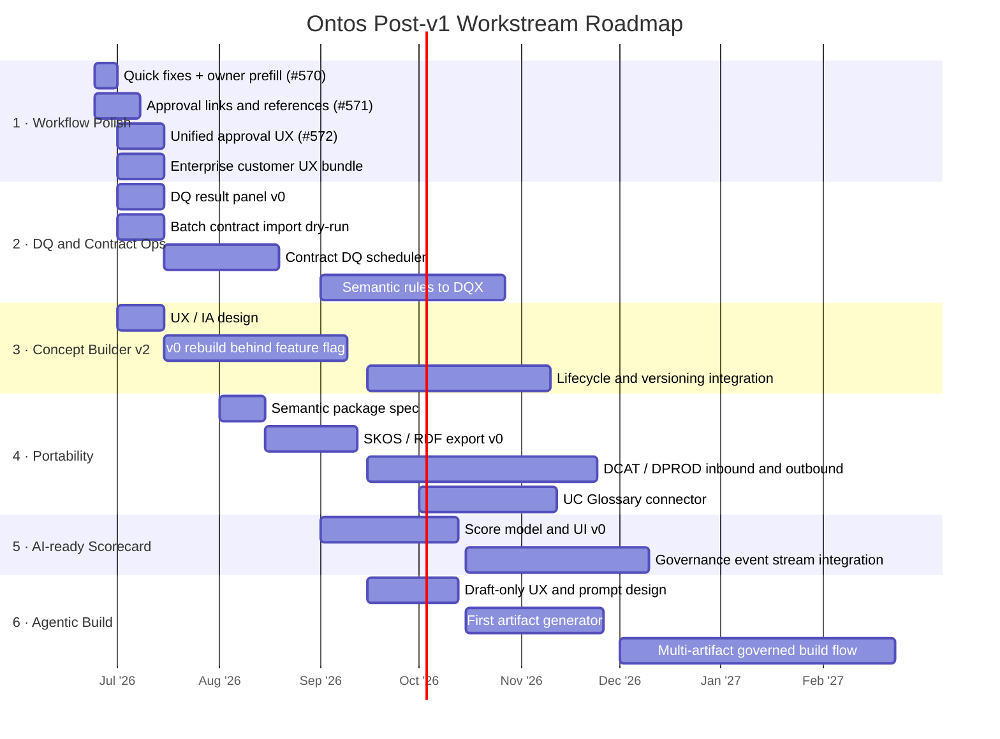
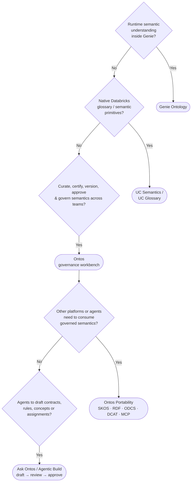

# RFC: Ontos Post-v1 Roadmap and AI-ready Governance Positioning

Status: Draft for team discussion
Owner: TBD
Created: 2026-06-24

## Purpose

Ontos v1 established stable core journeys for business semantics, data products, contracts, ownership, permissions, and wiring to physical Unity Catalog assets. The next phase should sharpen Ontos' role around AI-ready governance while complementing, not competing with, Genie Ontology and UC semantics.

This RFC proposes a post-v1 planning shape with concrete workstreams, issue/PRD references, rough effort, dependencies, and a release model that supports parallel contributors.

## Positioning

Ontos should be positioned as the governance workbench and portability layer for enterprise semantics:

- Genie Ontology optimizes runtime semantic understanding for Genie spaces.
- UC semantics / UC Glossary provide native Databricks semantic primitives.
- Ontos governs how semantic assets are curated, owned, certified, tested, versioned, approved, exported, and reused across domains, tools, and platforms.

Short version:

> Ontos is the governance control plane that makes enterprise semantics ready for AI, Genie, UC, and external consumption.

## Planning Model: Lanes, Not Sequential Versions

Version labels imply sequential execution, which does not match how we can actually deliver if multiple contributors work in parallel. The roadmap should therefore be managed as parallel lanes with independent epics and landing windows.

Recommended model:

- **Workstream lanes** describe durable product areas.
- **Epics/issues** describe executable scope.
- **Landing windows** describe likely delivery timing, not dependency order.
- **Release trains** package whatever is ready and coherent at cut time.
- **Feature flags / preview labels** allow larger capabilities to land incrementally.

Example:

| Lane | Example deliverables | Can ship with |
|---|---|---|
| Workflow polish | #570, #571, #572 | any patch/minor release |
| DQ operations | DQ result panel, schedule runner | partial preview before full scheduler |
| Concept Builder v2 | IA, screens, API, lifecycle | behind feature flag |
| Portability | SKOS/RDF, DCAT/DPROD, MCP | independent adapters |
| Agentic build | draft artifact generation | preview/draft-only mode |

This avoids saying "v1.2 must wait for v1.1." Instead, each lane has maturity states: `proposed -> designed -> in progress -> preview -> stable`.

### Roadmap at a Glance

## Recommended Workstreams

### 1. Workflow and Ownership Polish

This is the near-term confidence lane. It reduces v1 friction and makes Ontos feel production-ready.

References:

- #570 - "Copy from Team" -> Assign opens empty Assign Owner form.
- #571 - Rich references, hyperlinks, and reference documents in approval workflow steps.
- #572 - Unified access-approval UX across notification bell, Handle Access Grant, role requests, and My Actions.
- #335 - Entra principal picker.
- #431 - Consolidate team and ownership model.
- Enterprise customer deferred feedback: column descriptions, fully qualified names, product/deliverable wording, searchable group/SP picker, clearer Owner Team handling.
- Enterprise customer feedback: requester identity and justification in approval popups appears addressed in v1 and should be verified/closed; remaining items include product-owner-specific terms of use, data product tile click behavior, clearer data product vs deliverable mental model, unclear S/M/L sizing labels, catalog onboarding prerequisites.

Proposed scope:

- Fix owner prefill from team members.
- Add safe markdown links and reusable reference documents to approval steps.
- Consolidate approval dialogs and payload rendering only where v1 surfaces remain inconsistent.
- Make My Actions support inline approve/deny for all approvable items.
- Polish owner/team picker UX and wording.
- Verify v1 approval payload visibility covers requester and justification in all relevant flows; code already renders requester/reason for workflow approval and direct access-grant dialogs. Keep follow-up scope limited to missing fields such as on-behalf-of target, workspace/group, custom wizard answers, acknowledgements, non-access-grant request types, and inconsistent surfaces.
- Support product-owner-provided terms/rules as references or acknowledgement steps, not as a separate one-off legal mechanism.
- Clarify marketplace and product-detail navigation: tile opens product detail; subscribe/request is an explicit action.
- Replace or explain S/M/L sizing if it remains visible to end users.

Effort:

- Quick fixes: 0.5-3 days.
- Unified approval flow: 1-2 weeks.
- Customer polish bundle: 1-2 weeks.

Landing window:

- Immediate patch / next minor release.

### 2. Data Quality and Contract Operations Loop

This lane turns data contracts from static declarations into operational governance assets.

References:

- #59 - SHACL-based semantic DQ rules and DQX checks via Jobs.
- #125 - Per-entity compliance checks.
- Rail customer requirements: CRON schedule for specific data contracts and DQ checks; DQ results shown back in data contracts; existing repo reading; batch upload of data contracts.
- Field customer feedback: make operational status and failures visible in Ontos.
- Enterprise customer feedback: "Data Quality, Versioning & Traceability"; track quality, timeliness, and changes; notify consumers when data products change.

Proposed scope:

- Define a DQ result ingestion schema.
- Show latest DQ status on the data contract page: pass/fail, timestamp, failed rule count, job link, last error.
- Add contract-specific schedules for checks.
- Add DQ history/trend panel.
- Support batch contract import with dry-run/diff/apply.
- Add data product change notifications for material events: deliverable changed, contract changed, DQ status changed, owner changed, access policy changed.
- Treat "example data / first rows" as a bounded preview capability: reuse the existing Catalog Commander permission-aware preview pattern where possible, keep it sample-size-limited, and make it optional per deployment.
- Later: map semantic constraints to executable DQX checks.

Effort:

- DQ status panel v0: 1-2 weeks.
- Batch contract import v0: 1-2 weeks.
- Contract-specific scheduler + history: 3-5 weeks.
- Semantic rules to DQX: 4-8 weeks, depending on rule model.

Landing window:

- DQ visibility can land early.
- Scheduling and semantic rule generation should be treated as medium-term.

### 3. Concept Builder v2 and Ontology Lifecycle

This is the strategic core lane. The current Concept area should be rebuilt rather than incrementally patched.

References:

- #551 - Ontology Lifecycle Management.
- #520 - Multi-domain assignment.
- #469, #485, #482 - Term mapping.
- #442 - Unified version family.
- #330 - Configurable maturity levels.
- #95 - Search/discovery.
- #43 - Ontology actions.
- Additional ontology requirements doc: RDFS/SKOS, controlled vocabulary -> taxonomy -> ontology progression, concept-to-table and property-to-column assignment, RDF round trip, SPARQL search/validation, SHACL later, `uc:Action` semantics.
- Enterprise customer feedback: semantic interfaces and ontology graph to explain relationships between data products, IDs, tables, joins, and systems; business-maintained UI for company data knowledge.

Proposed scope:

- Rebuild information architecture for vocabularies, taxonomies, ontologies, concepts, properties, and actions.
- Add lifecycle states: draft, reviewed, certified, deprecated.
- Add ownership, steward review, comments, change history, and approval hooks.
- Support concept-to-table and property-to-column assignments.
- Support relationship modeling for IDs, joins, systems, and data product dependencies where this is needed for business understanding.
- Add duplicate/overlap detection for terms and metrics.
- Add term mapping workflows: suggest, review, bulk apply, rollback.
- Add search/discovery across concepts, assignments, and governed assets.

Effort:

- UX/design and IA: 1-2 weeks.
- v0 rebuild: 4-8 weeks.
- Lifecycle/versioning integration: 4-8 additional weeks, likely phased.

Landing window:

- Design can start immediately.
- Implementation should land behind a feature flag or preview route.

### 4. Portability and Federation

This is the clearest long-term differentiator from native-only semantics. MCP is useful, but it is not sufficient as the sole portability mechanism.

References:

- #550 - DPROD Catalog Publication / outbound DCAT-AP.
- #493 - External Marketplace Providers / inbound DCAT-AP.
- #489 - Ask Ontos handbook follow-ups: RDF handbook, embeddings, multi-locale.
- #551 - Ontology lifecycle, for versioned exports.
- Customer feedback: import/export from Atlan, Collibra, Power BI/DAX, GitHub, Confluence, OWL/OSI; avoid semantic lock-in.

Proposed scope:

- Define canonical Ontos semantic package format.
- Export SKOS/RDFS/RDF for concepts and relationships.
- Export ODCS for contracts where applicable.
- Implement outbound DCAT/DPROD publication.
- Implement inbound external catalog/provider ingestion.
- Provide MCP tools for runtime agent consumption: lookup concepts, retrieve contracts, inspect readiness, fetch DQ evidence.
- Document how external platforms consume Ontos semantics.

Position on MCP:

- MCP is good for live agent access and tool-based consumption.
- MCP is not enough for enterprise portability because catalogs, governance platforms, and procurement workflows often require files, APIs, standards, versioning, auditability, and batch exchange.
- Ontos should support both: standards-based package exchange plus MCP runtime access.

Effort:

- Semantic package spec: 1-2 weeks.
- SKOS/RDFS/RDF export v0: 2-4 weeks.
- Round-trip import/export: 4-8 weeks.
- DCAT/DPROD inbound/outbound: 6-10 weeks.
- MCP hardening: 2-6 weeks depending on current state.

Landing window:

- Start with export/package v0.
- Add UC Glossary sync after UC Glossary availability, likely August or later.

### 5. AI-ready Governance Scorecard

This lane turns Ontos from a management UI into an operating model for AI readiness.

References:

- #125 - Per-entity compliance checks.
- #330 - Configurable maturity levels.
- #421 - Governance event stream.
- Customer feedback: security, transparency, authoritative experts, semantic sprawl, role/persona-aware context.
- BeNeLux customer patterns: governance needs to be visible, explainable, and operational.
- Enterprise customer feedback: ensure newly created data products meet global requirements; clarify which compliance, access, sharing, and security processes are handled by the tool.

Proposed scope:

- Score readiness per domain, data product, contract, concept, or Genie candidate.
- Include signals such as owner assigned, certified concepts, contract present, DQ status, freshness, lineage, access workflow, documentation, maturity level, and glossary alignment.
- Provide remediation tasks and links to missing controls.
- Provide a "global DP requirements" checklist/template that can be configured by governance teams instead of hard-coding one customer's process.
- Distinguish tool-supported controls from external process controls, so Ontos does not implicitly own every data sharing/security process.
- Later: emit readiness events and integrate with notifications/workflows.

Effort:

- Score model and UI v0: 3-6 weeks.
- Event stream integration: 4-8 weeks.

Landing window:

- Can start after DQ status and concept lifecycle primitives are defined.

### 6. Agentic Build Layer

This extends Ask Ontos from question answering toward governed artifact generation, closer to a "Genie Code agent" for governance assets.

References:

- #489 - Ask Ontos handbook/RDF/embedding follow-ups.
- #43 - Ontology actions.
- #59 - Semantic DQ rules.
- #571/#572 - Approval references and unified approval UX, needed for safe review flows.
- Customer feedback: "Where do I edit it?", control/versioning/pruning, authoritative experts, semantic sprawl.

Proposed scope:

- Generate draft data contracts from UC metadata and existing docs.
- Suggest concept assignments for tables/columns.
- Draft glossary/concept definitions and synonyms.
- Propose DQ rules from profiling and semantic constraints.
- Detect duplicate or overlapping concepts and metrics.
- Generate workflow templates and approval references.
- Produce readiness remediation plans.

Guardrail:

- The agent should create drafts, diffs, and recommendations.
- Production changes should go through review, approval, and audit.
- Agent actions should be explainable and linked to source evidence.

Effort:

- Prompt/tool design and draft-only UX: 2-4 weeks.
- First artifact generator: 3-6 weeks.
- Multi-artifact governed build flow: 6-12 weeks.

Landing window:

- Start with narrow draft generation after the relevant artifact APIs stabilize.
- Do not block foundational Concept Builder / DQ / approval work on this lane.

## UC Glossary and Genie Ontology Dependency Strategy

UC Glossary is expected around August, so the plan should not wait for it. Instead:

- Define provider abstractions now.
- Model mappings and conflict handling now.
- Build import/export and lifecycle in Ontos independently.
- Add UC Glossary connector once the API and semantics are stable enough.

Assume Genie Ontology will continue improving quickly in curation, import/export, transparency, and cross-space reuse. Ontos should therefore avoid duplicating runtime Genie semantics and focus on governed enterprise semantics, cross-platform portability, evidence, quality, and operating model.

## Suggested Prioritization

### Quick wins

| Item | References | Effort | Rationale |
|---|---|---:|---|
| Owner prefill fix | #570 | 0.5-1 day | Obvious v1 bug; high trust impact |
| Approval links/references | #571 | 2-4 days | Useful across legal, policy, runbook, evidence flows |
| Enterprise customer UX polish | Enterprise customer deferred notes | 1-2 weeks | Reduces demo friction and resolves concrete marketplace/detail-page confusion |
| DQ result panel v0 | Rail customer, enterprise customer, #125 | 1-2 weeks | Makes contracts operational and addresses quality/timeliness visibility |
| Batch contract import dry-run | Rail customer | 1-2 weeks | Practical enterprise onboarding |
| Positioning decision tree | This RFC | 1-2 days | Helps team/customer alignment |

### Medium bets

| Item | References | Effort | Rationale |
|---|---|---:|---|
| Unified approval UX | #572 | 1-2 weeks | Enterprise-grade workflow consistency |
| Contract-specific DQ scheduler | Rail customer, enterprise customer, #59 | 3-5 weeks | Turns DQ into governed operation |
| Concept Builder v2 preview | #551, #520, #469/#485/#482 | 6-10 weeks | Strategic core |
| Semantic package export v0 | #550, #489 | 2-4 weeks | Portability proof point |
| AI-ready scorecard v0 | #125, #330 | 3-6 weeks | SME positioning and sales narrative |

### Larger bets

| Item | References | Effort | Rationale |
|---|---|---:|---|
| Ontology lifecycle management | #551, #442 | 6-10 weeks | Required for governed semantics |
| DCAT/DPROD inbound/outbound | #493, #550 | 6-10 weeks | Catalog federation story |
| Semantic rules to DQX | #59 | 4-8 weeks | Connect ontology to execution |
| Governance event stream | #421 | 4-8 weeks | Audit, automation, notifications |
| Agentic build layer | #489, #43, #59 | 6-12 weeks | Differentiated next-gen workflow |

## Current Codebase Verification Notes

Verified against the current local Ontos codebase on 2026-06-24. This is not a full QA pass, but it is enough to scope the enterprise customer feedback more critically.

| Area | Current code evidence | Planning impact |
|---|---|---|
| Approval requester/justification visibility | `ApprovalStepHandler` builds notification descriptions with requester, resource, permission, duration, reason, and justification fallback. `WorkflowApprovalResponseDialog` renders requester/resource/permission/duration/reason. `HandleAccessGrantDialog` renders requester/resource/duration/permission/submitted/reason. | Treat the original DT blocker as likely fixed in v1; verify with DT and close if confirmed. Keep #572 only for full/custom payload and surface consistency gaps. |
| Approval full/custom payload | `_extract_approval_facets()` is curated and only enriches `access_grant`. `WorkflowApprovalResponseDialogPayload` is a static field list. `RequiredActionsSection` only supports inline approve/deny for role requests; other unified approvals get an Open link. | #572 remains valid, but as "unify surfaces and carry full wizard payload", not "show requester/reason". |
| Product-owner-specific rules/TOU | Approval wizard has `legal_document` and `acknowledgement_checklist` steps, but `simpleMarkdown()` does not support links, and dormant `document_url` / `document_content` are not broadly rendered as reusable references. | #571 is the right implementation path: generic references/links/acknowledgements, not a DT-specific TOU feature. |
| Marketplace tile behavior | Marketplace product card click opens an info dialog; a separate external-link icon opens the full product detail page. It does not directly subscribe from the whole tile. | Partially addressed. Decide desired UX: keep info-dialog behavior or make card click open full details. This is UX polish, not roadmap strategy. |
| Deliverable descriptions | Data product details render `port.description` for deliverables. | Mark "column/deliverable descriptions missing" as likely partly addressed; verify if DT meant linked UC table column descriptions, which are not shown in the deliverables list. |
| Fully qualified deliverable asset names | Linked assets under deliverables display `rel.target_name || rel.target_id`; this may still be a short name rather than `catalog.schema.table`. | Keep as a concrete customer polish item: show/copy full FQN for linked deliverable assets. |
| Data product vs deliverable confusion | UI uses "Deliverables (Output Ports)" and request/subscription is product-level. | Keep as wording/information-architecture polish. Do not rebuild the product model solely for this. |
| Group/principal picker | `PrincipalPicker` supports directory-backed search with graceful manual fallback. `/api/workspace/groups` supports searchable group listing. | Basic picker capability exists. Remaining scope should be wiring/coverage in specific flows, not building a new picker from scratch. |
| Workspace picker | `/api/workspace/accessible-workspaces` currently returns the current workspace only and explicitly notes true multi-workspace listing as future enhancement. | Keep scope limited. Multi-workspace selection depends on account-level credentials/platform setup. |
| Owner team unselect/create | One product form has a `None` option, but `data-product-create-dialog.tsx` Owner Team select has no `None` item. `Copy from Team` still opens Assign Owner without passing selected member context. | Keep #570 and owner-team polish. Add "None/unselect in all product forms" as a small concrete fix. Inline team creation may be useful but should be scoped separately. |
| Catalog not found / onboarding prerequisite | Catalog visibility depends on UC/workspace binding and current OBO visibility. | Product can surface diagnostics/prerequisites, but should not own catalog enablement policy. |
| Quality/DQ | Generic quality items/panel and product quality badge exist. Contract quality rules exist. DQX profiling generates suggestions. Backend has `data_quality_check_runs/results` models and workflow code, but no obvious API/UI surfacing of execution results. | Map customer DQ/versioning/traceability to rail customer DQ operations. Focus on result surfacing, schedules, job/run status, and notifications, not inventing a second quality model. |
| Example data / first rows | Catalog Commander has permission-aware dataset preview via `/api/catalogs/dataset/{path}`. This is not surfaced in data product marketplace/details. | Limit scope: optionally reuse existing preview for linked tables; do not make sample data a default marketplace feature without permissions/privacy review. |
| Global valid data product requirements | There is a readiness API/component and maturity model, but the readiness component appears unused in the product detail page; maturity is shown inline. Defaults are generic, not customer-specific. | This supports the AI-ready scorecard lane. Scope as configurable templates/gates, not customer-specific hard-coded rules. |
| Semantic graph / ontology | Ontology graph, business terms, entity relationships, lineage views, and relationship editor exist. | DT ask is directionally aligned, but current Concept/ontology UX still needs a rebuild for business maintainability. |

## Enterprise Customer Feedback Triage

The field customer feedback reinforces several existing lanes rather than creating a customer-specific roadmap. Recommended disposition:

| Feedback theme | Disposition | Roadmap mapping | Scope note |
|---|---|---|---|
| Business owner approval requires admin access | Accept as defect/permission hardening | Workflow and Ownership Polish | Fix if still reproducible; do not rely on delegate workaround as target behavior |
| Duplicate justification for group and workspace | Verify before planning | Workflow and Ownership Polish | Mark as closed if resolved; avoid adding new scope unless still reproducible |
| Approval popup lacks requester and justification | Code indicates basic requester/reason visibility is addressed in v1; verify with DT and close if confirmed | #572 | Do not reopen broad scope unless remaining gaps exist across surfaces, custom fields, on-behalf-of, acknowledgements, or non-access-grant flows |
| Product-owner-specific rules/TOU on access request | Accept, but implement generically | #571, #572 | Model as reusable references/acknowledgements per product/workflow |
| Column descriptions and fully qualified table names | Accept as UX polish, but split | Workflow and Ownership Polish | Deliverable descriptions are already shown; linked asset FQNs and UC column descriptions still need verification/polish |
| Marketplace tile opens subscribe instead of detail | Partially addressed | Workflow and Ownership Polish | Current card opens info dialog and icon opens full details; decide whether full-card click should navigate to detail |
| Data product vs deliverable confusion | Accept as information architecture issue | Workflow polish; possibly Concept Builder later | Clarify wording and request scope; avoid rebuilding product model solely for this |
| Search/select existing groups and workspaces | Partially implemented, with platform constraints | #335 and ownership/access polish | Principal/group pickers exist; workspace endpoint is current-workspace-only in v1 |
| Owner team create/unselect | Accept, scoped | #431, #570 | Fix missing None/unselect coverage and #570 prefill first; inline team creation is a separate enhancement |
| Cannot find catalogs unless workspace enabled | Limit scope | Onboarding docs/admin prerequisite | Product can surface diagnostics, but should not own catalog enablement policy |
| Unclear target process for safe data sharing | Accept as configurable governance templates | AI-ready scorecard/workflows | Do not hard-code DT process; support templates and references |
| S/M/L sizing confusing | Accept as minor UX cleanup | Workflow polish | Explain, rename, or hide unless actionable |
| Show column names or sample rows when descriptions absent | Limit scope | DQ/contract operations; marketplace UX | Column names are safe metadata; sample rows should reuse existing permission-aware Catalog Commander preview and remain optional |
| Example data and field validation rules | Split | DQ operations | Field validation maps to contract/DQ rules; example data is optional/controlled preview |
| DQ, versioning, traceability, change notifications | Accept, consolidate with rail customer | DQ operations; governance event stream | Treat as shared DQ/evidence/change-event lane, not customer-specific |
| Access roles not usually part of data products | Push back partially | Positioning/workflows | Ontos can govern access workflows for sharing; it should not redefine enterprise IAM ownership |
| Semantic interfaces and ontology graph | Accept strategically | Concept Builder v2 | Fits Ontos' business-maintained semantic graph role |
| Ensure globally valid data products | Partially present; accept as configurable readiness | AI-ready scorecard | Readiness/maturity foundations exist, but need surfaced configurable templates/gates; avoid fixed DT requirements |
| End-to-end access/compliance process ownership | Clarify boundary | AI-ready scorecard/workflows | Ontos can orchestrate and evidence controls; external legal/security processes remain customer-owned |

## Decision Tree for Positioning

Use this as the basis for a visual:

1. Do you need runtime semantic understanding inside Genie?
   - Use Genie Ontology.
2. Do you need native Databricks glossary/semantic primitives?
   - Use UC semantics / UC Glossary.
3. Do you need to curate, certify, version, approve, test, and govern semantics across teams?
   - Use Ontos.
4. Do you need other platforms or agents to consume governed semantics?
   - Use Ontos portability: SKOS/RDF, ODCS, DCAT/DPROD, JSON/Markdown, MCP.
5. Do you need agents to draft contracts, rules, concepts, or assignments?
   - Use Ask Ontos / Agentic Build, with draft-review-approve controls.

## Open Questions

- Which lane has a committed contributor now, and which lane needs design first?
- Should Concept Builder v2 be feature-flagged inside the current app or built as a new route first?
- What is the minimum viable DQ result schema that supports rail customer requirements and future DQX integration?
- Which portability format should be the first public proof point: SKOS/RDF, ODCS, or DCAT/DPROD?
- How much of Ask Ontos should be retrieval/Q&A versus artifact generation in the next milestone?
- What level of UC Glossary integration should be committed before the product/API stabilizes?

## Proposed Next Step

Create tracking issues per workstream, link existing PRDs/issues underneath them, and use a GitHub Project view with fields:

- Lane
- Status
- Effort
- Landing window
- Dependency
- Customer driver
- Release vehicle

This keeps planning parallel while still allowing coherent releases.
