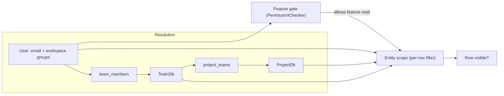

# Visibility rules (canonical matrix)

Authoritative answer for [issue #400](https://github.com/databrickslabs/ontos/issues/400): who sees what across Ontos entities, how identity resolves to scope, known deviations, and how to reproduce results locally.

Executable harnesses:

| Tier | Path | When |
|------|------|------|
| 1 | [backend/tests/integration/test_visibility_matrix.py](../src/backend/tests/integration/test_visibility_matrix.py) | CI / in-process SQLite |
| 2 | [backend/tests/e2e/test_visibility_matrix_live.py](../src/backend/tests/e2e/test_visibility_matrix_live.py) | Live backend + `TEST_USER_TOKEN` |
| 3 | [tests/e2e/playwright/visibility_matrix.spec.ts](../tests/e2e/playwright/visibility_matrix.spec.ts) | UI + screenshots → [visibility-rules-evidence/](visibility-rules-evidence/) |

Shared case definitions: [backend/src/tests/matrix/visibility_cases.py](../src/backend/src/tests/matrix/visibility_cases.py).

---

## 1. Concept primer

| Term | Meaning |
|------|---------|
| **User** | Workspace identity: email + workspace groups (SCIM), optionally overridden per request via `X-Test-*` headers when `TEST_USER_TOKEN` is set. |
| **Workspace admin** | Member of `APP_ADMIN_DEFAULT_GROUPS` (default `admins`). Checked by `is_user_admin`. |
| **Ontos role admin** | Effective `FeatureAccessLevel.ADMIN` on a feature via assigned groups / team `app_role_override` / applied-role override. Checked by `is_user_feature_admin`. |
| **Team** | `TeamDb` + `TeamMemberDb` (user email or workspace group as `member_identifier`). |
| **Project** | `ProjectDb` scoped via `project_teams` M:N — **membership is through assigned teams**, not `owner_team_id` alone. |
| **`owner_team_id`** | Managing / metadata team on a product or project; **does not grant access** unless that team is also in `project_teams`. |
| **Domain** | `DataDomain` linked from teams; used by the *domain-relationship* project list algorithm. |
| **Three-tier publication** | Contracts/products: personal draft (`draft_owner_id`) → team/project (`project_id`, `publication_scope=none`) → published (`publication_scope != none`). |

---

## 2. Identity → access resolution

Two layers apply on every feature:

1. **Feature gate** — `PermissionChecker(feature, level)` on routes ([authorization.py](../src/backend/src/common/authorization.py)).
2. **Entity scope** — per-row filter in repository/manager (only **Data Products** are fully enforced end-to-end today).



### Code references

| Step | Location |
|------|----------|
| Teams for user | [teams_repository.py:96-117](../src/backend/src/repositories/teams_repository.py) |
| Projects (strict membership) | [projects_repository.py:65-95](../src/backend/src/repositories/projects_repository.py) |
| Projects (domain-relationship list) | [projects_repository.py:177-257](../src/backend/src/repositories/projects_repository.py) |
| Workspace vs Ontos admin | [authorization.py:25-136](../src/backend/src/common/authorization.py) |
| Data product list scope | [data_products_repository.py:586-610](../src/backend/src/repositories/data_products_repository.py) |
| Data product route wiring | [data_product_routes.py:1638-1685](../src/backend/src/routes/data_product_routes.py) |

---

## 3. Per-entity canonical tables

Columns: **Viewer × ownership state → visible in list? | get by id? | editable?**

Only **Data Products** implement full list + get + update scope in one cascade. Other entities are noted inline.

### Data Products

| Viewer | Owner-only (draft) | Project P1, in Team A | Team-owned (Team A) | Orphan | Published |
|--------|-------------------|------------------------|---------------------|--------|-----------|
| Workspace admin | yes \| yes \| yes | yes \| yes \| yes | yes \| yes \| yes | yes \| yes \| yes | yes \| yes \| yes |
| Ontos `data-products:Admin` | yes \| yes \| **no** (DP1) | yes \| yes \| yes | yes \| yes \| yes | yes \| yes \| **no** (DP1) | yes \| yes \| yes |
| Producer A (Team A, P1) | own only | yes \| yes \| yes | yes \| yes \| yes | no | yes \| yes \| no |
| Consumer B (Team B, not P1) | own only | no | no | no | yes \| yes \| no |
| Outsider | own only | no | no | no | yes \| yes \| no |

Implementation: [data_products_repository.py:586-610](../src/backend/src/repositories/data_products_repository.py), [data_product_routes.py:1638-1685](../src/backend/src/routes/data_product_routes.py).

### Data Contracts

| Viewer | Personal draft | Project-scoped | `project_id` null | Published |
|--------|----------------|----------------|-------------------|-----------|
| Workspace admin | all | all | all | all |
| Producer (no `?project_id=`) | own drafts | **all** (DC1) | **all** (DC2) | all |
| Outsider | no | no | **yes** (DC2) | yes |

List path: [data_contracts_routes.py:99-113](../src/backend/src/routes/data_contracts_routes.py), three-tier helper: [data_contracts_repository.py:208-224](../src/backend/src/repositories/data_contracts_repository.py), [data_contracts_repository.py:331-374](../src/backend/src/repositories/data_contracts_repository.py).

### Business Glossaries

| Viewer | Collection with `scope_level` | Term |
|--------|--------------------------------|------|
| Any authenticated | **all** (GL1) | feature gate only |

[semantic_models_routes.py:842-854](../src/backend/src/routes/semantic_models_routes.py) — `scope_level` metadata exists; no per-user row filter.

### Assets

| Viewer | Consumer / Producer asset explorer |
|--------|-----------------------------------|
| Workspace admin | all (no ID restriction) |
| Producer with project access | **empty** after fail-closed DP list (AS1) |

[assets_manager.py:266-271](../src/backend/src/controller/assets_manager.py) calls `list_products(is_admin=False)` without caller scope.

### Asset Reviews

| Viewer | List with `?project_id=` from UI |
|--------|----------------------------------|
| Any | **unfiltered** (AR1) |

[data_asset_reviews_manager.py:257-261](../src/backend/src/controller/data_asset_reviews_manager.py), frontend: [data-asset-reviews.tsx:53-57](../src/frontend/src/views/data-asset-reviews.tsx).

### MDM

| Viewer | List without `?project_id=` |
|--------|----------------------------|
| Producer | **all configs** (MD1) |

[mdm_repository.py:54-55](../src/backend/src/repositories/mdm_repository.py).

### Process Workflows / Job Runs

| Viewer | Workflow list |
|--------|---------------|
| Feature permission only | `scope_config` affects **execution targets**, not list visibility (WF1) |

[process_workflows.py:31-33](../src/backend/src/db_models/process_workflows.py).

### Compliance

Feature-gated; no project/team row filter on policies (same pattern as glossaries).

### Catalog Commander

| Viewer | UC browse |
|--------|-----------|
| All | Unity Catalog privileges via OBO client only (CM1) |

Ontos teams/projects have **zero** effect.

### Projects

| Viewer | `GET /api/projects` (domain) | `get_user_projects` (strict) | `GET /api/projects/{id}` |
|--------|------------------------------|------------------------------|---------------------------|
| Group name contains `"admin"` substring | **all** (PR1) | varies | **no check** (PR3) |
| Workspace `admins` | all | all | **no check** (PR3) |
| Team member | domain-expanded set (PR2) | strict subset | **no check** (PR3) |

[projects_manager.py:193-203](../src/backend/src/controller/projects_manager.py), [projects_repository.py:177-257](../src/backend/src/repositories/projects_repository.py).

**PR4:** `ProjectDb.owner_team_id` is not auto-inserted into `project_teams` — owning-team members lack access unless explicitly assigned.

### Teams

Listed via [teams_repository.py:96-117](../src/backend/src/repositories/teams_repository.py) (direct or group membership).

### Comments

Filtered by entity + optional `project_id` + audience / role resolution in [comments_manager.py](../src/backend/src/controller/comments_manager.py).

---

## 4. Consolidated scenario matrix

Rows below are implemented in [visibility_cases.py](../src/backend/src/tests/matrix/visibility_cases.py) (`case_id = entity::row_state::viewer`).

| case_id | Visible | Get | Update | Notes |
|---------|---------|-----|--------|-------|
| `data_product::orphan::admin_ws` | yes | yes | yes | |
| `data_product::orphan::admin_ontos` | yes | yes | no (DP1 on live route) | update path uses `is_user_admin` only — see DP1 |
| `data_product::orphan::producer_a` | no | no | no | fail-closed |
| `data_product::project_p1::producer_a` | yes | yes | yes | |
| `data_product::project_p1::consumer_b` | no | no | no | |
| `data_product::team_owned_a::producer_a` | yes | yes | yes | |
| `data_product::draft_owner::producer_a` | yes | yes | yes | |
| `data_contract::other_project::producer_a` | **xfail DC1** | | | list without `project_id` |
| `data_contract::null_project::outsider` | **xfail DC2** | | | null `project_id` fail-open |
| `data_contract::personal_draft::producer_a` | yes | | | |
| `data_contract::published::outsider` | yes | | | tier 3 |
| `project::member_p1::producer_a` | yes | | | strict membership |
| `project::forbidden_get::outsider` | **xfail PR3** | | | get-by-id unchecked |
| `asset_review::project_p2::producer_a` | **xfail AR1** | | | |
| `asset::linked_dp_p1::producer_a` | **xfail AS1** | | | |
| `glossary::collection::outsider` | **xfail GL1** | | | |
| `team::member_a::producer_a` | yes | | | |
| `comment::on_dp_p1::outsider` | no | | | |
| `mdm::project_p2_unscoped::producer_a` | **xfail MD1** | | | |
| `workflow::project_scoped::producer_a` | **xfail WF1** | | | |

Seed data: [visibility_matrix_seed.yaml](../src/backend/src/data/visibility_matrix_seed.yaml). Personas: [test_personas.yaml](../src/backend/src/data/test_personas.yaml) (`admin_ws`, `admin_ontos`, `producer_a`, `consumer_b`, `outsider`).

---

## 5. Known deviations / follow-up backlog

| ID | One-line repro | Citation | Follow-up |
|----|----------------|----------|-----------|
| **DP1** | Ontos DP admin sees all in list but cannot update orphan (update checks workspace admin only) | [data_products_manager.py:576-592](../src/backend/src/controller/data_products_manager.py) | TBD |
| **DC1** | `GET /data-contracts` without `?project_id=` returns contracts outside caller projects | [data_contracts_routes.py:99-113](../src/backend/src/routes/data_contracts_routes.py) | TBD |
| **DC2** | `project_id IS NULL` contracts visible to every non-admin in list | [data_contracts_repository.py:194-199](../src/backend/src/repositories/data_contracts_repository.py) | TBD |
| **AR1** | UI sends `?project_id=`; backend list ignores it | [data_asset_reviews_manager.py:257-261](../src/backend/src/controller/data_asset_reviews_manager.py), [data-asset-reviews.tsx:53-57](../src/frontend/src/views/data-asset-reviews.tsx) | TBD |
| **AS1** | Asset scope calls `list_products` without caller scope → empty for producers | [assets_manager.py:266-271](../src/backend/src/controller/assets_manager.py) | TBD |
| **GL1** | Glossary collections listed without per-user filter | [semantic_models_routes.py:842-854](../src/backend/src/routes/semantic_models_routes.py) | TBD |
| **PR1** | `get_user_projects` treats any group containing `"admin"` as admin | [projects_manager.py:193-203](../src/backend/src/controller/projects_manager.py) | TBD |
| **PR2** | Domain project list ⊃ strict membership (shown but not selectable) | [projects_repository.py:177-257](../src/backend/src/repositories/projects_repository.py) | TBD |
| **PR3** | `GET /api/projects/{id}` has no access check | [projects_manager.py:142-150](../src/backend/src/controller/projects_manager.py) | TBD |
| **PR4** | `owner_team_id` not auto-added to `project_teams` | [projects](../src/backend/src/db_models/projects.py) | TBD |
| **AU1** | `get_user_team_role_overrides` omits `user_groups` in team lookup | [authorization.py:288-325](../src/backend/src/common/authorization.py) | TBD |
| **SS1** | Self-service bootstrap skips team member + `project_teams` | [self_service_routes.py:102-157](../src/backend/src/routes/self_service_routes.py) | TBD |
| **WF1** | Workflow `scope_config` does not filter list | [process_workflows.py:31-33](../src/backend/src/db_models/process_workflows.py) | TBD |
| **MD1** | MDM list not auto-scoped to user projects | [mdm_repository.py:54-55](../src/backend/src/repositories/mdm_repository.py) | TBD |
| **CM1** | Catalog Commander = UC only (documented, not a bug) | — | TBD |

Tier 1/2 tests mark deviation rows `xfail(strict=True)` so fixes surface as unexpected passes.

---

## 6. How to reproduce

### curl (runtime persona impersonation)

Requires `TEST_USER_TOKEN` in [src/backend/.env](../src/backend/.env) (see [CONTRIBUTING.md](../CONTRIBUTING.md)).

```bash
export TEST_USER_TOKEN='<your-token>'
export EMAIL='matrix-producer-a@test.local'
export GROUPS='["data-producers"]'

curl -s -H "X-Test-Token: $TEST_USER_TOKEN" \
  -H "X-Test-User-Email: $EMAIL" \
  -H "X-Test-User-Groups: $GROUPS" \
  http://localhost:8000/api/data-products | jq 'map(.name)'
```

Compare names against the matrix for that persona. Repeat for `/api/data-contracts`, `/api/projects`, etc.

### Role group bindings ([#462](https://github.com/databrickslabs/ontos/pull/462))

As of #462 (merged on `main`), fresh installs and regenerated `settings.yaml` seed `assigned_groups` on default roles so `X-Test-User-Groups` from [test_personas.yaml](../src/backend/src/data/test_personas.yaml) resolve to the matching Ontos role (e.g. `data-producers` → Data Producer with READ on data-products).

**Existing databases** created before #462 may still have empty `assigned_groups` until you add groups in **Settings → Roles**, delete/re-seed role rows, or let the Tier 2 harness backfill them.

The Tier 2 harness ([test_visibility_matrix_live.py](../src/backend/tests/e2e/test_visibility_matrix_live.py)) calls `_sync_persona_role_bindings()` as workspace admin before matrix cases, so live runs do not depend on manual UI edits.

**Post-#462 Tier 2 expectation:** matrix personas with workspace groups (`data-producers`, `data-consumers`, `data-governance-officers`, `admins`) receive HTTP 200 on `/api/data-products`. The `outsider` persona (empty groups) still gets **403 at the feature gate** — those live rows are skipped, not failed. Typical outcome: **12 passed, 3 skipped** (2× outsider + empty deviation parametrization).

### Pytest

```bash
cd src
hatch -e dev run pytest backend/tests/integration/test_visibility_matrix.py -v --no-cov

TEST_USER_TOKEN='<token>' hatch -e dev run pytest backend/tests/e2e/test_visibility_matrix_live.py -v --no-cov
```

### Playwright evidence

```bash
# Frontend :3000 + backend :8000 running; token in env / localStorage
cd tests/e2e/playwright
npx playwright test
# Screenshots: docs/visibility-rules-evidence/<entity>__<persona>.png
```

Typecheck only: `npx tsc --noEmit visibility_matrix.spec.ts` (from `tests/e2e/playwright`).
