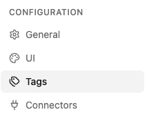
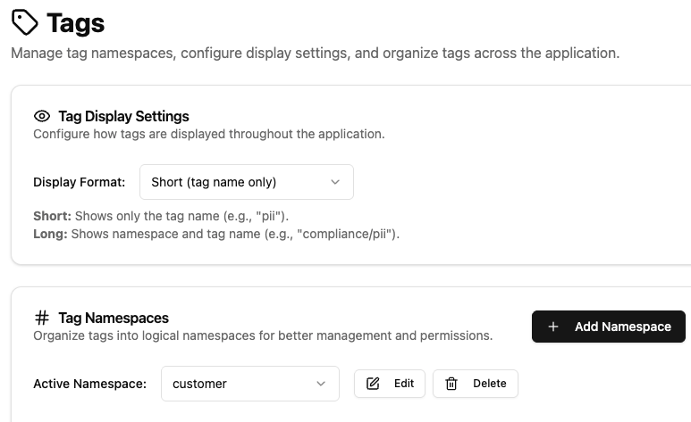
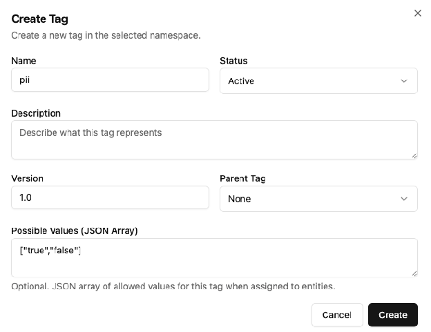

# Configurations

## 🏷️ Manage Tags

To manage tags, you need to have the Admin role. Tags are standardized metadata attributes used to categorize, organize, and discover data products in Ontos.

### Definition and attributes

When defining a Tag, several key characteristics of tags in Ontos include:

1. **Namespaces**: Organize tags into logical namespaces for better management and permissions.

2. **Status**: Define the tag's current state throughout its lifecycle.

   | Status | Description |
   | ------ | ----------- |
   | ✅ **Active** | *Approved & live -* The asset is fully validated, actively maintained, and safe for production workflows, analytics, and business decision-making. |
   | 📝 **Draft** | *Work-in-progress -* The asset is currently being created or modeled. It is unverified and strictly off-limits for production queries or official reporting. |
   | 🔍 **Candidate** | *Under review -* The asset has been proposed for official adoption or certification and is currently being evaluated and validated. |
   | ⚠️ **Deprecated** | *Warning / Phasing out-* The asset is scheduled for retirement. While still functional, users are actively discouraged from using it, as a replacement exists or is coming soon. |
   | ⏸️ **Inactive** | *Temporarily paused -* The asset is disabled or dormant—not currently updated or used in live operations—but remains intact in case it needs to be reactivated later. |
   | 🗄️ **Retired** | *End-of-life -* The asset is permanently decommissioned and unsupported. It is retained solely as an archived record for historical reference, audit, or compliance purposes. |

3. **Permissions**: Control which groups can access and modify tags in this namespace. These are applied at the Identity Group level with the following access levels:

   1. Read Only
   2. Read/Write
   3. Admin

### Creating and Managing Tags

1. Navigate to the ⚙️ *Settings* page located in the upper right corner.
2. Locate the 🏷️ *Tags* option on the settings sidebar.

3. Select a *Tag Display Settings* option based on your preference.
4. Add or remove *Namespaces* to be associated with tags.

5. Click on the *Add Tag* button and provide a name, status, version, parent tag, and optionally possible values in a JSON Array format.

6. Click on *Create* to generate your Tag.

## ⚠️ Limitations and Considerations

:::note
This section is under construction. It will cover the limitations of tags, what they cannot do, and their compatibility with Unity Catalog (UC) tags.
:::
