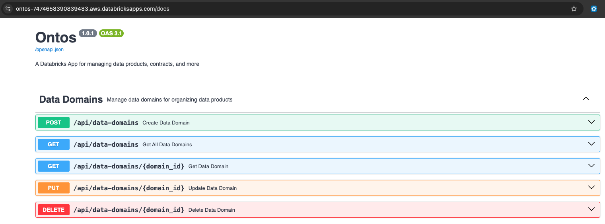
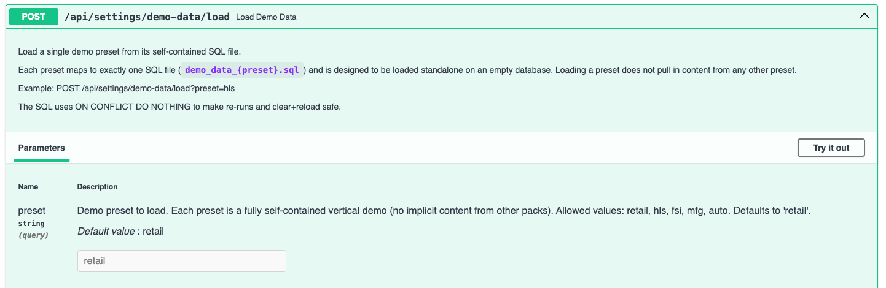
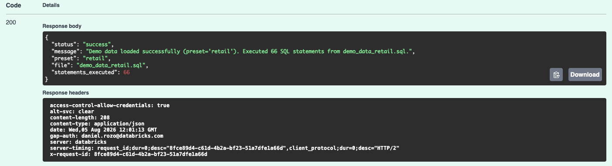
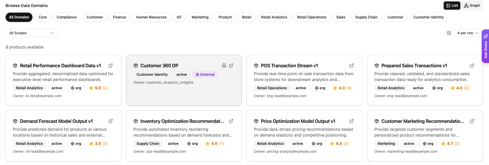
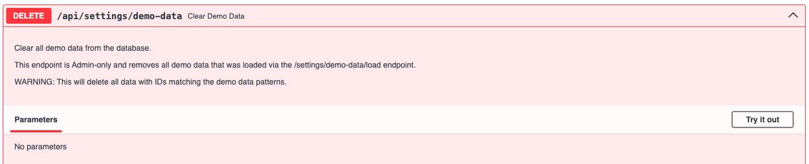
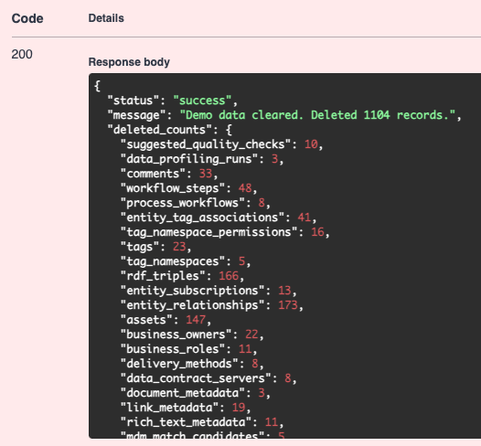

# Demo Setup

Ontos ships with demo data, which can be loaded or removed on demand. To achieve this, follow the instructions below:

:::warning

We suggest avoiding loading demo data on your Ontos production instance and instead using low-priority environments like sandbox or demo setups.

:::

## Load data

To load the demo data, follow these steps:

1. Navigate to the Ontos API documentation page (by editing the URL in the browser's address bar):

```bash
open https://<your-ontos-app-url>/docs
```



2. Locate the *demo-data* POST API endpoint, select *Try it out*, and then *Execute*



3. The API should give you a 200 Successful response



4. Reload the Ontos Marketplace page, and you'll see your demo data loaded.



## Delete data

To remove the demo data, follow these steps:

1. Navigate to the Ontos API documentation page (by editing the URL in the browser's address bar):

```bash
open https://<your-ontos-app-url>/docs
```

2. Locate the *demo-data* DELETE API endpoint, select *Try it out*, and then *Execute*



3. The API should give you a 200 Successful response


