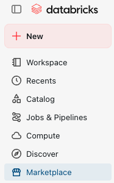
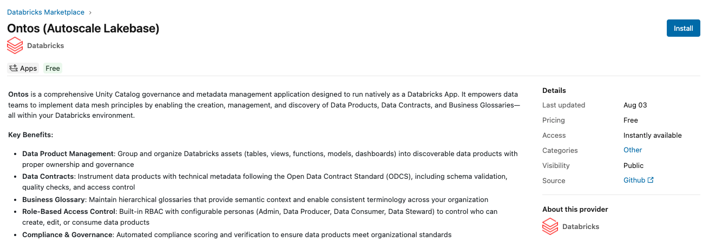
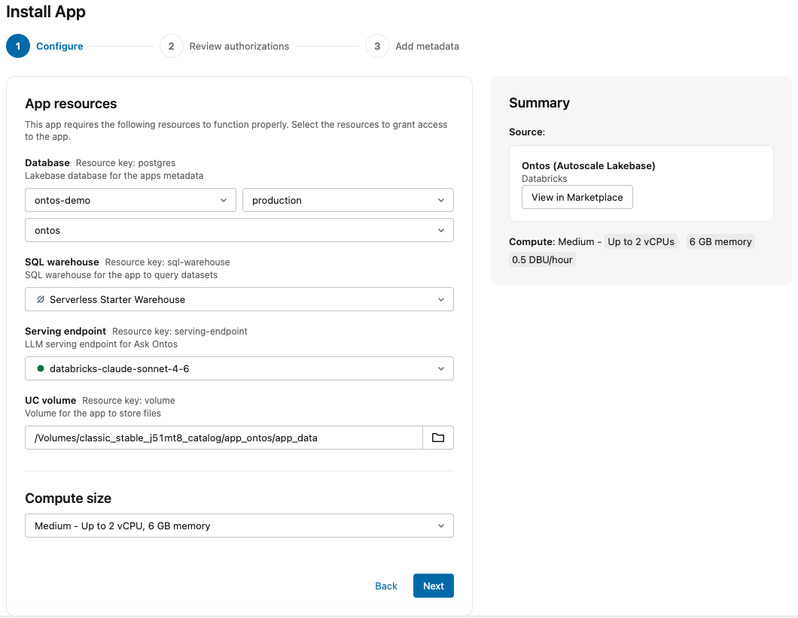
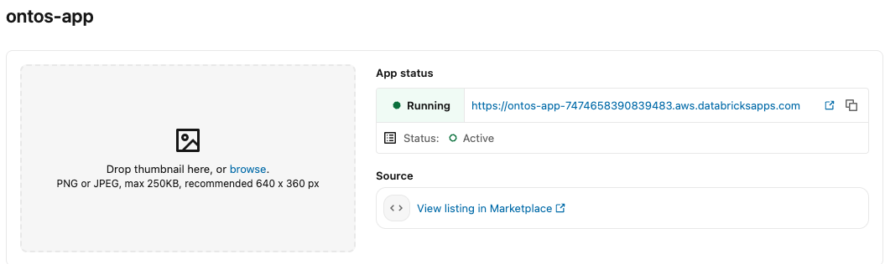

# Databricks Marketplace setup

To install Ontos from the Databricks Marketplace, follow these steps:

## Configuration process

1. In the Databricks Lakehouse, select 🛒 *Marketplace* from the left sidebar

2. In the search bar, enter *Ontos* and select the *Autoscale Lakebase* option.

3. Review the application details, general technical requirements, and considerations before proceeding to the next step.
4. Click the *Install* button in the top-right corner, check the box to agree to the usage terms and conditions, and proceed to click on *Continue* when ready.
5. After accessing the Databricks Apps portal, select:
    1. Your Lakebase project, branch, and database.
    2. A DBSQL Warehouse Endpoint
    3. A LLM Serving Endpoint
    4. The managed Unity Catalog volume created as part of the required resources stated in the [Getting Started](./) section

:::info

You're free to choose the compute size for your Ontos instance. For production environments, we recommend using Large or XLarge T-shirt sizes.

:::

6. After you're done with the app resources, click on *Next*.

7. Input the app name, a description of your preference, and Serverless usage policies if needed.

:::tip

We recommend implementing [Serverless Usage Policies](https://docs.databricks.com/aws/en/admin/usage/budget-policies) to attribute costs for your Ontos Application, providing better visibility for the organization.

:::

8. Once the deployment process is complete, you should be able to access your Ontos application via the URL provided in the *App Status* box located in the *Overview* page.

