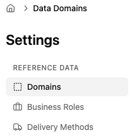
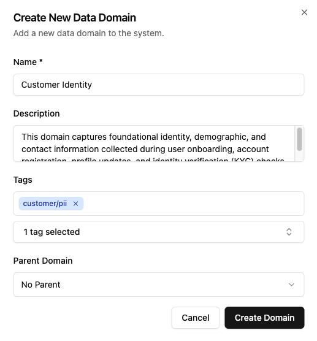
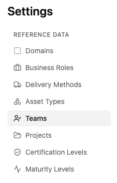
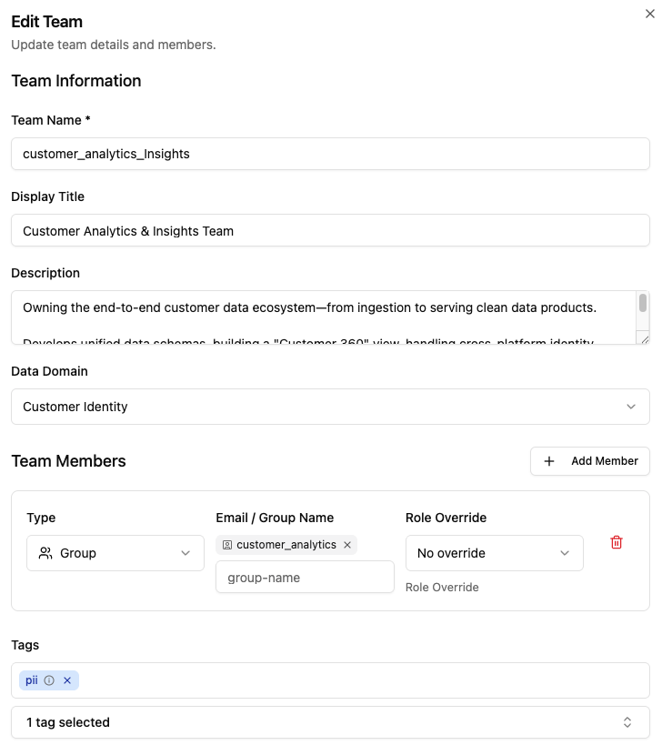
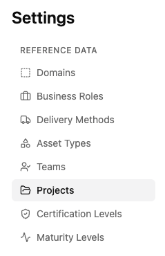
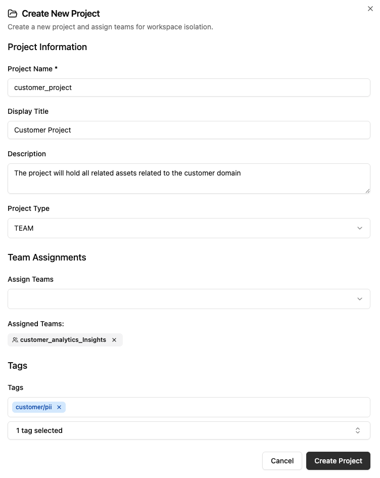
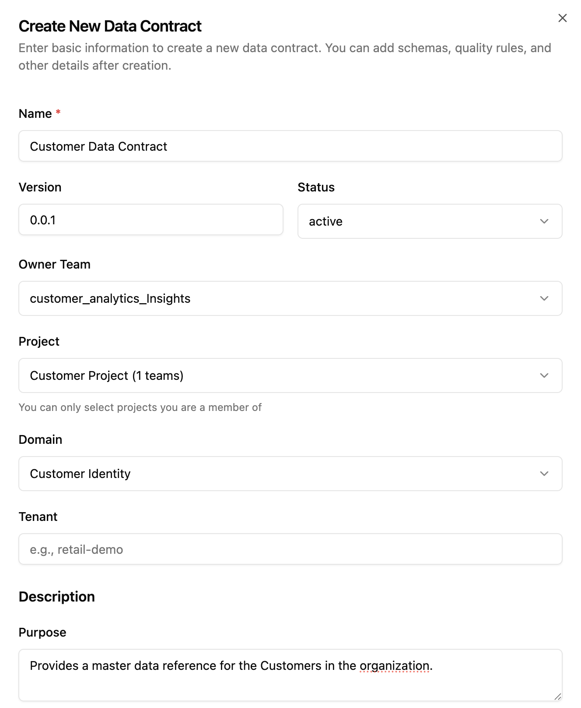
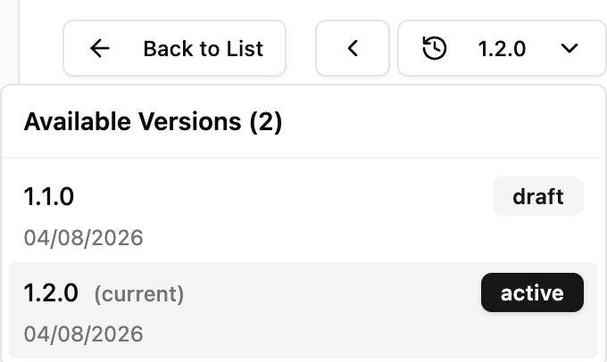
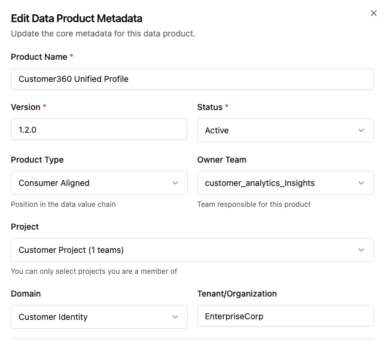

# Basic Elements
The following section explains the fundamental elements for working with Ontos, including creating Domains, collaborating with Projects and Teams, defining Data Contracts, and creating Data Products. 

:::warning
This guide does not include other elements, as we continue to build the documentation with your support. If you want to contribute, please help us by following the [Contributing guidelines](../contributing.md).
:::


## Work with Domains

As an Admin, you can create and manage multiple logical grouping elements in Ontos, including Domains. 

Admins can perform multiple actions such as creating, modifying, and deleting domains.

:::tip
We suggest using tags to enhance discoverability, management, and governance. Check the [Tags](../admin_guide/configs) guide to understand the process.
:::

### Create a domain

1. Navigate to the ⚙️ *Settings* page located in the upper right corner.



2. Select the *Domains* tab from the *Settings* sidebar.
3. Click on *Add new Domain*.
4. Provide a name, description, tags, and associated parent domains.



5. Click on *Create Domain*.

:::info
To edit/modify your team’s attributes, click on the the teams name on the Teams page. 
:::

## Projects and Teams

Teams and Projects are organizational structures within the workspace that facilitate collaboration and management of data initiatives. Refer to the [Core Concepts](../introduction/concepts) page for Teams and Projects definitions. 

:::tip
Multiple teams can be assigned to a single project, providing logical boundaries that support different development or operational activities.
:::

### Using Teams

To create and use teams in Ontos, follow these steps:

1. Navigate to the ⚙️ *Settings* page located in the upper right corner and select *Teams* from the sidebar panel.



2. Click on the *Add New Team* button.
3. Provide your new team's name, domain, members, and associated Tags.



4. Click on *Create Team* to finish.

:::tip
To edit/modify your team's attributes, click on the team's name on the Teams page.
:::

### Define Projects

To create and manage Projects in Ontos, follow these steps:

1. Navigate to the ⚙️ *Settings* page located in the upper right corner and select *Projects* from the sidebar panel.



2. Click on the *Add New Project* button.
3. Provide the project details, including name, display title, type, assigned teams, and optional Tags.



:::tip
To edit/modify your project's details, click on the Project name on the Project page.
:::

## Define Data Contracts

Data Contracts define specifications and guarantees for data assets following the Open Data Contract Standard (ODCS) v3.1.0. They include schema details, quality guarantees, semantic links to business concepts, and support versioning to monitor contract evolution.

For a basic definition of Contracts, please refer to the [Core Concepts](../introduction/concepts) page.

### Contract lifecycle

Data Contracts in Ontos have a lifecycle and follow the order described below:

| Stage Name | Description | Status |
| --- | --- | --- |
| 📝 Draft | Initial creation. Defines scope, fields, types, and SLAs. | In Progress |
| 🙋 Proposed | Stakeholder review of requirements and definition. | Awaiting Review |
| 🔍 Under Review | Validation by legal, compliance, and engineering teams. | Active Evaluation |
| ✅ Approved | Contract finalized and accepted by all parties. | Finalized |
| 🚀 Active | Contract is implemented, enforced, and operational. | Deployed & Monitored |
| 🏅 Certified | Verified for compliance, quality, and standards. | Compliant & Proven |
| ⚠️ Deprecated | No longer recommended; replacement planned. | Sunset Notice |
| 🛑 Retired | Officially decommissioned and archived. Not in use. | Archived |

### Create and modify contracts

To create a Data Contract, follow these instructions:

1. Select the 📄 *Contracts* option in the Ontos sidebar.
2. Click on the *New Contract* button.
3. Add the details to your new Data Contract.



4. Select *Create Contract* to finish.

:::tip
To edit/modify your Data Contract, click on the Contract name from the Contracts page.
:::

### Upload contracts

In Ontos, you can upload predefined Data Contracts in ODCS v3.1.0 format. Currently, Ontos accepts JSON, YAML, or text files following the ODCS schema.

To upload an ODCS contract to Ontos:

1. Select the 📄 *Contracts* option in the Ontos sidebar.
2. Click on the *Upload File* button.
3. Select your ODCS contract file to upload or upload the following sample Customer contract:

<details>
<summary>Sample Customer 360 Core contract (ODCS JSON)</summary>

```json
{
  "apiVersion": "v3.1.0",
  "kind": "DataContract",
  "id": "urn:datacontract:customer:customer-360-core",
  "version": "1.0.0",
  "status": "active",
  "name": "Customer 360 Core",
  "domain": "customer",
  "dataProduct": "customer-360",
  "tenant": "AcmeRetailInc",
  "description": {
    "purpose": "Deduplicated view of every Acme retail customer with contact details and marketing consent.",
    "usage": "Customer segmentation, churn modelling and marketing activation. Join on customer_id.",
    "limitations": "Contains personal identifiers. Marketing activation must respect marketing_opt_in."
  },
  "tags": ["customer", "pii"],
  "servers": [
    {
      "server": "acme-prod-uc",
      "type": "databricks",
      "environment": "prod",
      "host": "dbc-a1b2c3d4-e5f6.cloud.databricks.com",
      "catalog": "acme_prod",
      "schema": "customer_360"
    }
  ],
  "schema": [
    {
      "name": "customers",
      "physicalName": "customers_v1",
      "logicalType": "object",
      "physicalType": "table",
      "description": "One row per customer.",
      "properties": [
        {
          "name": "customer_id",
          "description": "Immutable surrogate key issued at first contact.",
          "logicalType": "string",
          "logicalTypeOptions": { "format": "uuid" },
          "physicalType": "STRING",
          "required": true,
          "unique": true,
          "primaryKey": true,
          "primaryKeyPosition": 1,
          "classification": "internal",
          "examples": ["6f2a7c1e-8b34-4d5a-9f10-2c7e5a41b9d0"]
        },
        {
          "name": "email",
          "description": "Primary lowercase email address.",
          "logicalType": "string",
          "logicalTypeOptions": { "format": "email" },
          "physicalType": "STRING",
          "required": false,
          "classification": "restricted",
          "examples": ["ada.lovelace@example.com"]
        },
        {
          "name": "full_name",
          "description": "Customer's display name.",
          "logicalType": "string",
          "physicalType": "STRING",
          "required": false,
          "classification": "restricted"
        },
        {
          "name": "country_code",
          "description": "ISO 3166-1 alpha-2 country of residence.",
          "logicalType": "string",
          "logicalTypeOptions": { "pattern": "^[A-Z]{2}$" },
          "physicalType": "STRING",
          "required": true,
          "classification": "internal",
          "examples": ["GB", "DE"]
        },
        {
          "name": "status",
          "description": "Lifecycle state of the customer record.",
          "logicalType": "string",
          "logicalTypeOptions": { "pattern": "^(prospect|active|dormant|churned)$" },
          "physicalType": "STRING",
          "required": true,
          "classification": "internal",
          "examples": ["active"]
        },
        {
          "name": "marketing_opt_in",
          "description": "True when the customer has given explicit consent to marketing contact.",
          "logicalType": "boolean",
          "physicalType": "BOOLEAN",
          "required": true,
          "classification": "internal"
        },
        {
          "name": "updated_at",
          "description": "UTC timestamp of the last change to this record.",
          "logicalType": "timestamp",
          "physicalType": "TIMESTAMP",
          "required": true,
          "classification": "internal"
        }
      ],
      "quality": [
        {
          "description": "customer_id is never null.",
          "type": "library",
          "metric": "nullValues",
          "mustBe": 0,
          "dimension": "completeness",
          "severity": "error"
        },
        {
          "description": "The golden record is deduplicated.",
          "type": "library",
          "metric": "duplicateValues",
          "mustBe": 0,
          "dimension": "uniqueness",
          "severity": "error"
        }
      ]
    }
  ],
  "team": {
    "name": "Customer Data Platform",
    "members": [
      {
        "username": "r.okonkwo@acme.example.com",
        "name": "Rachel Okonkwo",
        "role": "Data Product Owner"
      },
      {
        "username": "s.varga@acme.example.com",
        "name": "Sam Varga",
        "role": "Lead Data Engineer"
      }
    ]
  },
  "roles": [
    {
      "role": "customer_360_reader",
      "access": "read",
      "firstLevelApprovers": "Data Product Owner"
    }
  ],
  "slaProperties": [
    { "property": "latency", "value": 2, "unit": "h", "element": "customers.updated_at" },
    { "property": "frequency", "value": 1, "unit": "d", "element": "customers.updated_at" }
  ],
  "support": [
    {
      "channel": "#customer-360-support",
      "tool": "slack",
      "url": "https://acme.slack.com/archives/C0CUST360"
    }
  ],
  "contractCreatedTs": "2026-08-04T09:00:00+00:00"
}
```
</details>


### Contract actions

Once a contract is created, users in Ontos can perform various actions, including:

#### Certify

Certify a contract for high-value or regulated use cases. Certified contracts are publicly visible with a certification badge.

Certification is available at the following levels:

- Bronze
- Silver
- Gold

#### Publish

Publishing defines the scope of visibility, indicating who can discover this entity once published. The available scopes are:

| Scope | Description |
| --- | --- |
| Organization | Visible across the organization |
| Domain | Individual domain within the organization |
| Not published | Remains part of the project (private or team) that it belongs to |
| External | Visible outside the organization |

#### Request

Types of requests to be performed on the data contract, including:

| Request | Description |
| --- | --- |
| Change Status | Transition the [lifecycle](#contract-lifecycle) status of this contract to another stage. |
| Deploy to Unity Catalog | Request approval to deploy this contract to Unity Catalog. |
| Publish | Request to publish this contract with a defined visibility scope. |
| Certification | Request that this contract be certified at a specific level. |
| Access | Request permission to view and use this data contract. |

#### Comments

Displays a timeline of activities, including contract object modifications and user comments. Comments can be submitted to project-level boundaries or at the Global level.

#### Create a new version

Generates a new Data Contract version based on user input. After creating it, a dropdown menu appears on the main contract page, showing the current and past versions.



#### Delete

Deletes the current version of the Data Contract.

:::warning
Make sure you don't delete certified or active versions. Transition the state into Deprecated first and then proceed to delete if needed.
:::

## Build Data Products

Data Products are organized collections of assets with defined interfaces and status levels, supported by Ontos elements for governance and integration.

For a basic definition of Data Products, please refer to the [Core Concepts](../introduction/concepts) page.

### Data product status

Ontos supports two data product states, namely:

- **Active:** The product is healthy, fully supported, and up to date.
- **Deprecated:** The data product is marked for retirement, signaling it will be shut down as it reaches the end of its lifespan.

### Data product types

Ontos supports the following types associated with Data Product definitions:

- 🗄️ **Source:** Raw data resides in operational systems, databases, or third-party tools—like PostgreSQL, API payloads, or logs. It’s optimized for running the business, not for analytics.

- 🪞 **Source-Aligned Data Product:** Clean, standardized, analytical data owned by the domain that produces it. It accurately mirrors the operational reality of that domain without changing its core meaning.

- 🧩 **Aggregate Data Product:** A combined, higher-level data product created by blending data from multiple source-aligned products across different domains (e.g., combining "Orders", "Customer Profiles", and "Marketing Campaigns" into a single unified "Customer Lifetime Value" data product).

- 🎯 **Consumer-Aligned Data Product:** A highly specialized data product designed to meet the precise needs of a particular downstream use case, dashboard, or application. For example, it could be a custom feature-store dataset created specifically for a "Real-Time Recommendation Engine" or a pre-aggregated dataset intended for an "Executive Financial Board Deck."


### Create and modify products

To create a Data Product, follow these instructions:

1. Select the 📦 *Products* option in the Ontos sidebar.
2. Click on the *Create Product* button.
3. Add the details to your new Data Product.



4. Once ready, click on *Create Product*.

### Upload data products

In Ontos, you can upload predefined ODPS in JSON or YAML format. To upload an ODPS file to Ontos:

1. Select the 📦 *Products* option in the Ontos sidebar.
2. Click on the *Upload File* button.
3. Select your ODPS file to upload.

<details>
<summary>Sample Customer 360 Unified Profile (OPDC YAML)</summary>
```yaml
apiVersion: v1.0.0
kind: DataProduct
id: c360-prod-98f2-4e2b-b819-0123456789ab
name: Customer360 Unified Profile
version: 1.2.0
status: active
domain: Customer Experience
tenant: EnterpriseCorp

description:
  purpose: Provides a consolidated, 360-degree view of customer identity, lifetime value, engagement metrics, and consent preferences across web, mobile, and in-store channels.
  limitations: Refreshed nightly via batch ETL. Real-time streaming events are not included in this batch view. PII fields are masked for non-compliance roles.
  usage: Suitable for executive reporting, marketing segmentation, churn risk modeling, and CRM profile enrichment.

tags:
  - customer
  - customer360
  - crm
  - analytics
  - pii

# Source datasets ingested by this Data Product
inputPorts:
  - name: raw_crm_contacts
    version: 1.0.0
    contractId: 81a0b321-4f11-471d-a19d-72e8bc1a0011
    tags: ["salesforce", "crm"]
  - name: online_orders_events
    version: 2.1.0
    contractId: 92b0c432-5f22-482e-b20e-83f9cd2b0022
    tags: ["ecommerce", "transactions"]
  - name: marketing_consent_log
    version: 1.0.0
    contractId: 03c0d543-6f33-493f-c30f-94fa0e3c0033
    tags: ["consent", "privacy"]

# Exposed datasets and APIs consumed by downstream teams
outputPorts:
  - name: customer_360_gold_table
    description: Unified relational table containing master customer demographic and engagement attributes.
    type: tables
    version: 1.2.0
    contractId: a111bb22-cc33-4dd4-ee55-ff6666666666
    tags: ["snowflake", "gold-tier", "sql"]

  - name: customer_profile_api
    description: RESTful API for real-time customer profile lookups by Customer ID or Email hash.
    type: api
    version: 1.0.0
    contractId: b222cc33-dd44-4ee5-ff66-aa7777777777
    tags: ["rest", "api", "low-latency"]

# Management interfaces for lineage, cataloging, and operational controls
managementPorts:
  - name: data-dictionary
    type: catalog
    content: schema-documentation
    description: Field-level schema metadata, data types, and data dictionary links.
  - name: pipeline-telemetry
    type: topic
    content: operational-metrics
    description: Kafka topic broadcasting pipeline health, batch completion stats, and row counts.

# Operational, escalation, and ownership details
team:
  name: Customer Data Engineering Team
  email: data-team-c360@enterprisecorp.com
  slack: "#help-customer360-data"

supportAndCommunicationChannels:
  - type: slack
    url: "https://enterprisecorp.slack.com/archives/C0123456789"
    description: Real-time support and query channel.
  - type: documentation
    url: "https://docs.enterprisecorp.com/data-catalog/c360"
    description: Comprehensive integration guide and data dictionary.
  - type: ticketing
    url: "https://jira.enterprisecorp.com/projects/C360"
    description: Issue tracking and data enhancement requests.

# Documentation and business lineage links
authoritativeDefinitions:
  - type: businessDefinition
    url: "https://confluence.enterprisecorp.com/display/DATA/Customer360+Business+Glossary"
    description: Standard enterprise definitions for Customer Lifetime Value (CLV) and Churn Score calculations.
  - type: transformationImplementation
    url: "https://github.com/enterprisecorp/dbt-customer360"
    description: Repository containing dbt transformations and SQL models.

# Custom Metadata Extensions (Governance, Privacy & SLA)
customProperties:
  - property: dataSensitivityLevel
    value: Confidential
    description: Contains masked PII requiring RBAC authorization.
  - property: complianceFrameworks
    value: ["GDPR", "CCPA"]
    description: Applicable data protection and consent rules.
  - property: refreshFrequency
    value: Daily at 02:00 UTC
    description: Batch refresh timing window.
  - property: SLA_Availability
    value: "99.9%"
    description: Service Level Agreement for output port availability.
```
</details>


### Data product actions

Once a product is created, users in Ontos can perform various actions, including:

#### Certify

Certify a data product for high-value or regulated use cases. Certified products are publicly visible and accompanied by a certification badge.

Certification is available at the following levels:

- **Bronze**
- **Silver**
- **Gold**

#### Request

Types of requests to be performed on the data product, including:

| Request | Description |
| --- | --- |
| Change Status | Directly change the [status](#data-product-status) of this product. |
| Publish | Request to publish this product with a defined visibility scope. |
| Certification | Request that this product be certified at a specific level. |
| Access | Request permission to view and use the data product. |

#### Comments

Just as with Data Contracts, comments for Data Products display a timeline of activities, including modifications and user comments. Comments can be submitted to project-level boundaries or at the Global level.

#### Create a new version

Versioning is also supported in Ontos for Data Products. Specify a new version for your Data Products incrementally.


#### Delete

Deletes the current version of the Data Product.

:::warning
Make sure you don’t delete certified or active versions. Transition the state into Deprecated first and then proceed to delete if needed.
:::
