# Discover and Subscribe

In this guide, you'll be able to create, publish, discover, and subscribe to well-defined Data Products in Ontos. The goal after this walkthrough is to:

1. As a *Data Producer*, publish *Active* products to the Marketplace; view and notify subscribers.
2. As a *Data Consumer*, be able to discover *Data Products* and *Subscribe* (with a reason) to receive notifications on deprecation, new versions, and compliance violations.

## Customer background

**Bricks&Co** is a fictional omnichannel retailer: hundreds of physical stores ("bricks"), a busy e-commerce site, and a mobile app. Customer data is scattered across a point-of-sale system, the e-commerce platform, a CRM, and a loyalty program. Nobody can answer a deceptively simple question with confidence: *"Who is this customer, across all of our channels?"*

Bricks&Co has implemented Ontos, the data governance and data-product platform from Databricks Labs, to address this. Ontos enables teams to define, govern, and publish data products supported by formal data contracts, organized by domains and delivered via projects.

This guide follows the Customer team as they stand up their first governed data product: a trustworthy Customer 360 Profile. It is the authoritative, deduplicated golden record for every customer — identity, contact details, consent, loyalty tier, and lifetime value — published for analytics, marketing activation, and the service desk. Additionally, the Marketing team has a Data Consumer user within Ontos who searches for Customer domain data products and requests access from the Customer domain team for their Marketing campaigns, supporting Bricks&Co's strategic initiatives.

:::warning
We **strongly** recommend running these guides on test/sandbox instances of your Ontos deployment, and not in a **production** environment.
:::

## Prerequisites

- **Repository:** For this guide, we provision the resources by utilizing the scripts from the `ontos-customer-360-guide` repository in [GitHub](https://github.com/danielrozo-db/ontos-customer-360-guide).
- **API permissions:** You can call the Ontos API to provision resources or authenticate using the CLI with a profile (e.g., `ontos`).
- **Users:** You have access to other user identities who will embody the *Consumer* and *Producer* beyond the *Admin* role you're already assuming.

## High-level Process

The use case at Bricks&Co is illustrated in the image below. We will go through a simple publication and subscription process where the Customer core domain will grant access to the Marketing team to the Customer 360 Profile data product.

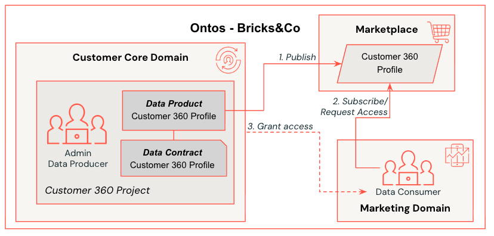

## Publishing a Data Product

Once you've created the resources on the prerequisites page, proceed with these steps if you have the Data Producer role in Ontos:

1. From the top-level drop-down box, select the *Bricks&Co Customer 360 Project*.
2. Go to the Data Products page from the *Overview* section of the main page.
3. Click on the *Customer 360 Profile* data product.
4. Take some time to explore the details of the Data Product.

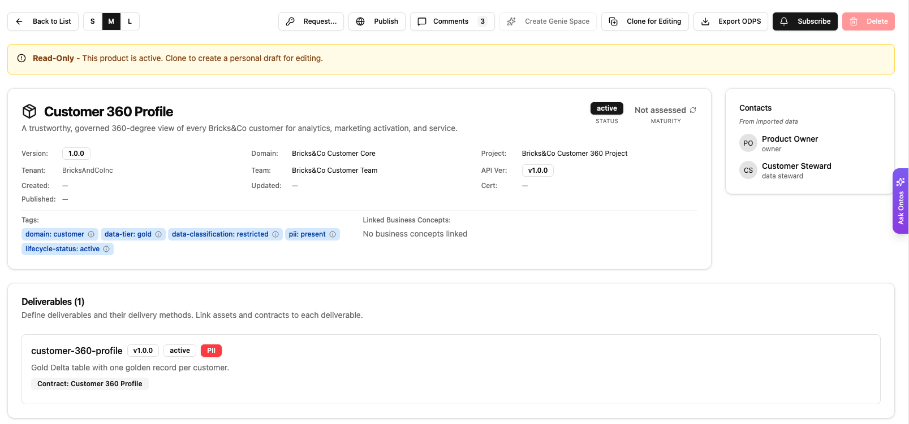

5. On the top-level options, click *Publish* and confirm the Publication scope: *Organization*.

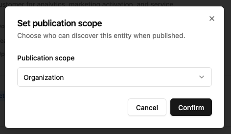

:::info
As a Data Producer, your actions on a Data Product are limited unless you have Admin rights. If you cannot view certain details, please switch to an Admin role.
:::

## Request Access

With the Data Consumer role, proceed to follow these steps to discover, subscribe, and request access to a Data Product:

1. Select the *Marketplace* page from the Discover sidebar.
2. From the list, select the *All domains* or the *Bricks&Co Customer Core* domain.

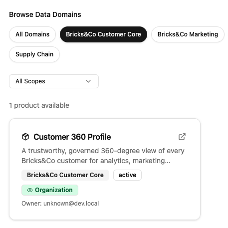

3. On the Customer 360 Profile preview page, select *Go to Details*.
4. From the data product top-level actions, select *Request* with the following options:
   1. *Request type*: Request Access
   2. *Reason for Access*: *I need access to the Data Product as it will support our customer marketing campaign initiatives for the next quarter.*
   3. *Duration*: 1 month.
5. Submit the request by clicking on *Send Request*.

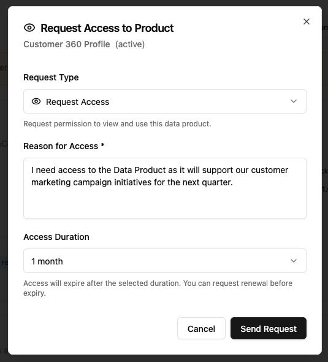

6. Back in the Data Product page, select the *Subscribe* option to receive notifications about this product.
7. Once the request is approved, you will receive a notification with the details.

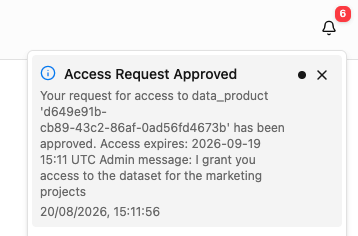

## Approve Access

As a user with the Admin role, there are two ways to look at access requests on Data Products.

**Option 1: Notification icon**

1. Click the top-level *Notifications* bell icon.
2. Click the *Approve/Deny* button for the newly created Approval Required item.

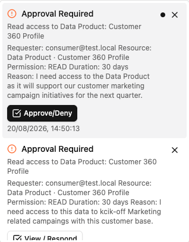

3. Review the request from the requester and select the *Approve* button.

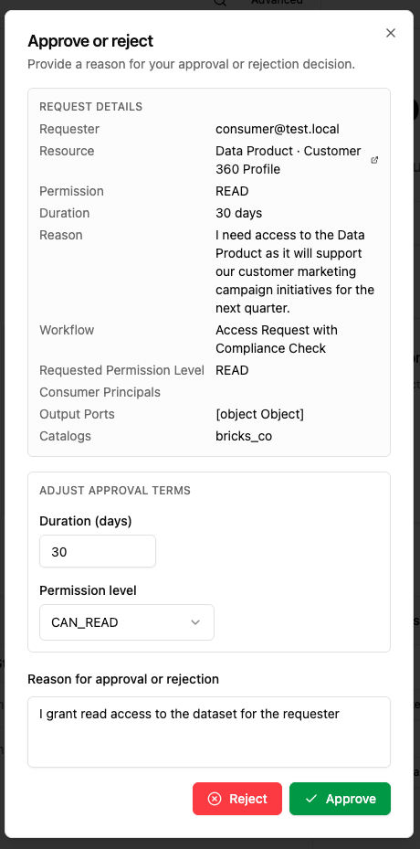

**Option 2: Access Grants page**

1. In the main Data Product page, scroll down to the *Access Grants* section.
2. Click on *Review* located in the far right section of the row.

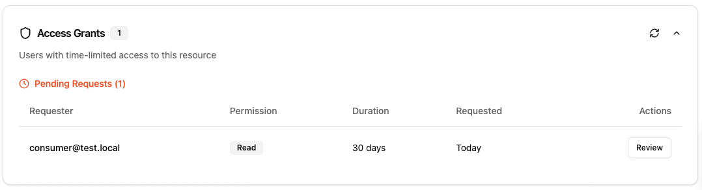

3. Add the grant duration, permission level, and message, then approve the request.

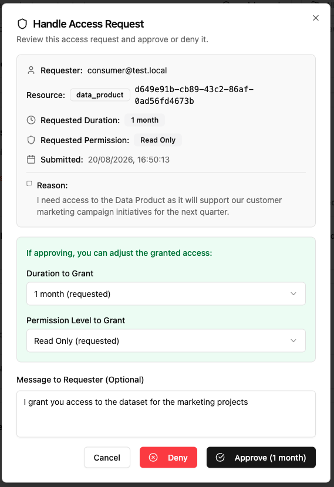

## Revoking Access

As an Admin, you can also revoke granted access to your data products. To achieve this:

1. In the main Data Product page, scroll down to the *Access Grants* section.
2. Click on *Actions* located in the far right on the *revoke* icon for the desired User.

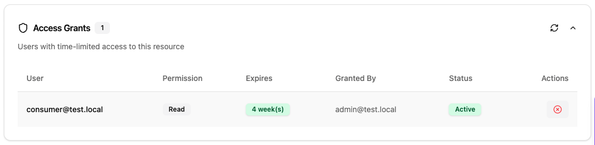

3. Select *Revoke Access* to remove the user from the resource.

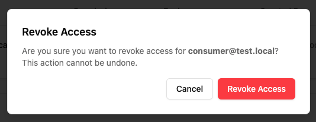

:::warning
Make sure you unsubscribe from the data product before deleting the created resources using the `99_cleanup.sh` script from the `ontos-customer-360-guide`.
:::
